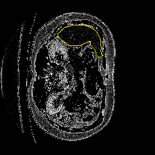
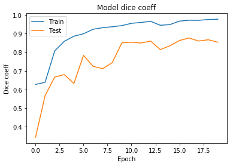

# Liver Segmentation with U-Net

*Final project of the Deep Learning course followed at [IMT Atlantique](https://www.imt-atlantique.fr/en).*

The code of this project is largely inspired by [this repository](https://github.com/jocicmarko/ultrasound-nerve-segmentation), a tutorial for a Kaggle competition about ultrasound image nerve segmentation. The goal of this project is to adapt the code to the segmentation of liver images as described in [this article](https://arxiv.org/pdf/1702.05970.pdf).

## Data

The data to be used are available in NifTi format [here](https://www.dropbox.com/s/hx3dehfixjdifvu/ELU-502-ircad-dataset.zip?dl=0).

This dataset consists of 20 medical examinations in 3D, we have the source image as well as a mask of segmentation of the liver for each of these examinations. We will use the [nibabel library](http://nipy.org/nibabel/) to read associated images and masks.

## Model

We will train a U-net architecture, a fully convolutional network. The principle of this architecture is to add to a usual contracting network, layers with upsampling operators instead of pooling. This allows the network to learn context (contracting path), then localization (expansive path). Context information is propagated to higher resolution layers thanks to skip-connections. So we have images of the same size as input.

In the data.py script, we perform axial cuts of our 3D images. So 256x256 images are input to the network.

## Evaluation

As metric we will use the [Dice coefficient](https://en.wikipedia.org/wiki/S%C3%B8rensen%E2%80%93Dice_coefficient) (which is quite similar to the Jaccard coefficient).

## How it works

1. First download the data whose link has been given previously
2. Create a 'raw' folder
3. In the 'raw' folder, create a 'test' folder, and a 'train' folder
4. Then separate the data in two sets (train and test, typically we use 13 samples for the train set and 7 for the test set) and put them in the corresponding directories that you can find in the 'raw' folder
5. Run data.py, this will save the train and test data in npy format
6. Finally launch the notebook, you can observe a curve of the Dice coef according to the number of epochs and visualize your predictions in the folder 'preds'

(Feel free to play with the parameters: learning rate, optimizer etc.)

## Some results

Finally we get this kind of predictions for a particular cut (thanks to the mark_boundaries function that you can find in the notebook), we can observe the liver is delimited in yellow:

The evolution of the Dice coef for 20 epochs, this plot shows that we have consistent results and a test Dice coef reaching almost 0.87:

